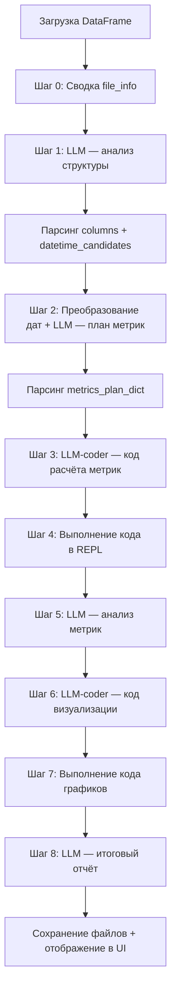
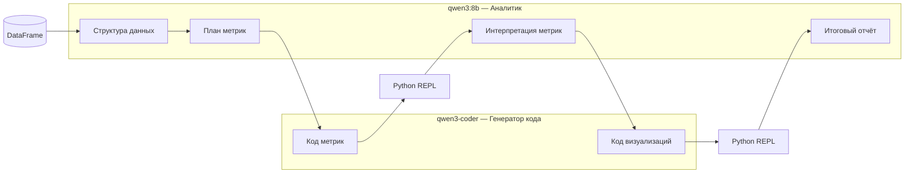

# Электронный Data Scientist

Документация и описание алгоритма работы приложения на базе `ins_temp3.py`.

Цель документа — зафиксировать логику системы для последующего переноса на другие фреймворки (FastAPI, Gradio, Django, CLI, оркестраторы вроде LangGraph и т.д.) без привязки к Streamlit.

---

## 1. Назначение проекта

**Электронный Data Scientist** — автоматизированный пайплайн анализа табличных данных (CSV / Excel).

Система:

1. Загружает датасет по пути к файлу.
2. С помощью LLM определяет структуру данных и план метрик.
3. Генерирует и выполняет Python-код для расчёта статистик.
4. Интерпретирует результаты на русском языке.
5. Строит графики и формирует итоговый отчёт.

Пользователь взаимодействует через веб-интерфейс Streamlit, но **бизнес-логика не зависит от UI** — её можно вынести в отдельные модули/сервисы.

---

## 2. Стек технологий

| Компонент | Технология | Роль |
|-----------|------------|------|
| UI | Streamlit | Ввод путей, кнопка запуска, отображение результатов |
| Данные | pandas, numpy, openpyxl | Загрузка и обработка таблиц |
| LLM (аналитика) | Ollama → `qwen3:8b` | Структура данных, план метрик, текстовый анализ, финальный отчёт |
| LLM (код) | Ollama → `qwen3-coder:latest` | Генерация Python-кода метрик и визуализаций |
| Оркестрация промптов | LangChain (`LLMChain`, `PromptTemplate`) | Связка промпт + модель |
| Выполнение кода | `langchain_experimental.utilities.PythonREPL` | Запуск сгенерированного Python в изолированной среде |
| Визуализация | matplotlib, seaborn | Графики (генерируются LLM-кодом) |
| Отчёты | txt, docx (`python-docx`) | Сохранение результатов на диск |

### Внешние зависимости

- **Ollama** должна быть запущена локально (`ollama serve`).
- Модели должны быть скачаны заранее:
  ```bash
  ollama pull qwen3:8b
  ollama pull qwen3-coder
  ```

---

## 3. Структура проекта

```
электронный DS/
├── ins_temp3.py          # основная рабочая версия (документирована здесь)
├── ins_temp2.py          # альтернативная версия (20 графиков, другой промпт отчёта)
├── requirements.txt      # Python-зависимости
├── DOCUMENTATION.md      # этот файл
└── venv/                 # виртуальное окружение
```

---

## 4. Запуск

```bash
cd "/Users/sweetd0ve/электронный DS"
python3 -m venv venv
source venv/bin/activate
pip install -r requirements.txt

# Убедиться, что Ollama запущена
ollama serve

# Запуск приложения (обязательно через venv!)
python -m streamlit run ins_temp3.py
```

Откроется браузер: `http://localhost:8501`

---

## 5. Пользовательский сценарий (UI)

Приложение состоит из 4 экранных блоков:

### Блок 1 — Ввод данных
- Пользователь вводит **полный путь** к файлу `.csv` или `.xlsx`.
- Файл читается с автоопределением кодировки (`utf-8` → `latin1` → `cp1251`).
- Путь сохраняется в `st.session_state["file_path"]`.
- Показываются первые строки таблицы.

### Блок 2 — Путь для результатов
- Пользователь указывает директорию для сохранения артефактов.
- Проверяется возможность создания папки и записи файлов.
- Путь сохраняется в `st.session_state["output_dir"]`.

### Блок 3 — Запуск анализа
- По кнопке «Запустить анализ» выполняется 8-шаговый пайплайн (см. раздел 6).

### Блок 4 — Результаты
- Отображаются все промежуточные и финальные артефакты из `session_state`.
- Графики подгружаются из `output_dir` по маске `plot_*.png`.

---

## 6. Алгоритм работы (основной пайплайн)

Ниже — полная последовательность шагов при нажатии кнопки анализа.



---

### Шаг 0. Подготовка контекста для LLM

**Вход:** DataFrame из `load_df_from_state()`.

**Действия:**
- Формируется текстовая сводка `file_info_summary`:
  - `df.info()`
  - первые 10 строк
  - типы столбцов (`dtypes`)
  - размерность `(rows, cols)`

**Выход:** строка `file_info_summary` → передаётся в Шаг 1.

---

### Шаг 1. Анализ структуры данных (LLM Analyst)

| Параметр | Значение |
|----------|----------|
| Модель | `qwen3:8b` (temperature=0.55) |
| Промпт | `struct_analyze` |
| Chain | `LLMChain` → `chain_structure.run(file_info=...)` |

**Задача LLM:** определить столбцы, их типы и кандидатов на datetime.

**Ожидаемый формат ответа (строго парсится regex):**

```
---COLUMNS_START---
Столбец: имя
Тип: тип
Описание: описание
---COLUMNS_END---
---DATETIME_CANDIDATES_START---
col1, col2
---DATETIME_CANDIDATES_END---
```

**Парсер:** `parse_struct_analyze_response()` → словарь:

```python
{
  "columns": [{"name": "...", "type": "...", "description": "..."}],
  "datetime_candidates": ["col1", "col2"]
}
```

**Сохранение в session_state:**
- `data_structure_raw` — сырой ответ LLM
- `data_structure` — JSON для отображения
- `parsed_data_structure` — распарсенный dict

**Ошибка:** если парсинг не удался → пайплайн останавливается.

---

### Шаг 2. План метрик (LLM Analyst)

**Предобработка:**
1. DataFrame перезагружается из файла.
2. Столбцы из `datetime_candidates` конвертируются в `datetime64` (`preprocess_dates_based_on_llm`).
3. Формируется обновлённая сводка `file_info_summary_processed`.

| Параметр | Значение |
|----------|----------|
| Модель | `qwen3:8b` |
| Промпт | `m_plan` |
| Chain | `chain_metrics_plan.run(data_structure=...)` |

**Задача LLM:** для каждого столбца предложить список метрик (mean, median, nunique, min_date и т.д.).

**Формат ответа:**

```
---METRICS_START---
Столбец: Age
Метрики: count, mean, median, std
---METRICS_END---
```

**Парсер:** `parse_metrics_plan_response()` → `metrics_plan_dict`:

```python
{"Age": ["count", "mean", "median"], "Sex": ["count", "nunique", "mode"]}
```

**Сохранение:**
- `metrics_plan` (JSON-строка)
- `metrics_plan_dict` (dict)

---

### Шаг 3. Генерация кода расчёта метрик (LLM Coder)

| Параметр | Значение |
|----------|----------|
| Модель | `qwen3-coder:latest` (temperature=0.2) |
| Промпт | встроенный шаблон `prompt_code_gen` |
| Chain | `chain_code_gen.run(metrics_plan=..., df_structure_info=...)` |

**Вход промпта:**
- описание структуры DataFrame после обработки дат
- `metrics_plan_dict` в JSON

**Задача LLM:** написать Python-код, который:
- использует глобальный `df` (уже загружен в REPL)
- считает только указанные метрики
- выводит результат: `print(metrics_results)`

**Сохранение:** `st.session_state["calculation_code"]`

---

### Шаг 4. Выполнение кода метрик (Python REPL)

**Функция:** `safe_code_execution(code, "расчета метрик", required_imports)`

**Алгоритм `safe_code_execution`:**

1. Извлечь чистый код из markdown-блока (`extract_python_code`).
2. Добавить обязательные импорты в начало (`pandas`, `numpy`).
3. Статическая проверка (`static_code_analysis`):
   - синтаксис через `ast.parse`
   - предупреждение о `.resample()` без `set_index`
4. Перезагрузить DataFrame (`load_df_from_state`).
5. Применить `preprocess_dates_based_on_llm`.
6. Применить `handle_missing_values_before_analysis`:
   - datetime: удалить строки с NaT
   - числовые: заполнить `0`
   - остальные: заполнить `'нет данных'`
7. Положить `df` в `repl.locals["df"]`.
8. Выполнить код: `repl.run(final_code_to_execute)`.
9. Вернуть stdout как строку.

**Сохранение:**
- `metrics_results_raw` — текстовый вывод `print(metrics_results)`
- `generated_calculation_code.py` — сгенерированный код на диск

**Ошибка:** если в выводе есть `Traceback` или `Ошибка выполнения` → стоп.

---

### Шаг 5. Анализ рассчитанных метрик (LLM Analyst)

| Параметр | Значение |
|----------|----------|
| Модель | `qwen3:8b` |
| Промпт | `data_analyze` |
| Chain | `chain_analysis.invoke({})` |

**Вход:** `metrics_results_raw` (сырой текст метрик).

**Задача LLM:** написать интерпретацию на русском (~40–50 предложений), подробно по каждому столбцу.

**Сохранение:**
- `analysis_summary`
- `analysis_summary_report.txt`
- `analysis_summary_report.docx`

---

### Шаг 6. Генерация кода визуализации (LLM Coder)

| Параметр | Значение |
|----------|----------|
| Модель | `qwen3-coder:latest` |
| Промпт | `prompt_viz` |

**Вход промпта:**
- `df_structure_info`
- `metrics_results_raw`
- `analysis_summary`
- `output_dir`

**Требования к коду (из промпта):**
- ровно **30 графиков**
- matplotlib + seaborn
- цветные графики (`palette='tab10'`, `cmap='viridis'`)
- сохранение: `plot_{столбцы}_{тип}.png` в `output_dir`
- без `plt.show()`, только `plt.savefig()`
- каждый график в `try-except`

**Сохранение:** `viz_code`

---

### Шаг 7. Выполнение кода визуализации (Python REPL)

Аналогично Шагу 4, но:
- контекст: `"визуализации"`
- импорты: pandas, numpy, matplotlib (Agg backend), seaborn, os
- та же предобработка `df`

**Сохранение:** `generated_visualization_code.py` + PNG-файлы в `output_dir`.

---

### Шаг 8. Итоговый отчёт (LLM Analyst)

| Параметр | Значение |
|----------|----------|
| Модель | `qwen3:8b` |
| Промпт | `final_rep` |
| Chain | `chain_report.invoke({})` |

**Вход:** `analysis_summary` из Шага 5.

**Задача LLM:** структурированный повествовательный отчёт на русском:
- характеристика данных
- качество и полнота
- проблемы (пропуски, выбросы, дубликаты)
- закономерности
- рекомендации по очистке и дальнейшему анализу

**Сохранение:**
- `final_report` в session_state
- `final_report.txt`
- `final_report.docx`

---

## 7. Состояние приложения (`session_state`)

Ключевые поля, которые накапливаются по ходу пайплайна:

| Ключ | Тип | Когда заполняется |
|------|-----|-------------------|
| `file_path` | str | Блок 1 UI |
| `output_dir` | str | Блок 2 UI |
| `data_structure_raw` | str | Шаг 1 |
| `data_structure` | str (JSON) | Шаг 1 |
| `parsed_data_structure` | dict | Шаг 1 |
| `metrics_plan` | str (JSON) | Шаг 2 |
| `metrics_plan_dict` | dict | Шаг 2 |
| `calculation_code` | str | Шаг 3 |
| `metrics_results_raw` | str | Шаг 4 |
| `analysis_summary` | str | Шаг 5 |
| `viz_code` | str | Шаг 6 |
| `final_report` | str | Шаг 8 |

---

## 8. Выходные файлы на диске

После успешного анализа в `output_dir` появляются:

| Файл | Описание |
|------|----------|
| `generated_calculation_code.py` | Код расчёта метрик |
| `generated_visualization_code.py` | Код построения графиков |
| `analysis_summary_report.txt` | Текстовый анализ метрик |
| `analysis_summary_report.docx` | DOCX-версия анализа |
| `final_report.txt` | Итоговый отчёт |
| `final_report.docx` | DOCX-версия итогового отчёта |
| `plot_*.png` | До 30 графиков |

---

## 9. Вспомогательные функции (ядро логики)

Эти функции **не зависят от Streamlit** (кроме вызовов `st.info/error`) и являются кандидатами для выноса в отдельный модуль `core/`:

| Функция | Назначение |
|---------|------------|
| `extract_python_code` | Извлечение кода из markdown ```python``` |
| `convert_numpy_types` | Сериализация numpy/pandas типов в Python-типы |
| `parse_struct_analyze_response` | Парсинг ответа LLM по структуре |
| `parse_metrics_plan_response` | Парсинг плана метрик |
| `static_code_analysis` | AST-проверка + эвристики |
| `load_df_from_state` | Загрузка CSV/Excel по пути |
| `preprocess_dates_based_on_llm` | `pd.to_datetime` для кандидатов |
| `handle_missing_values_before_analysis` | Импутация/удаление пропусков |
| `safe_code_execution` | Подготовка df + запуск REPL |
| `get_df_info` | Отладочная сводка DataFrame |

---

## 10. Роли LLM в системе



**Принцип разделения:**
- **Аналитик** — рассуждение, планирование, текст на русском.
- **Кодер** — генерация исполняемого Python с жёсткими ограничениями в промпте.

---

## 11. Промпты (краткий справочник)

| Имя переменной | Назначение | Модель |
|----------------|------------|--------|
| `struct_analyze` | Определение столбцов и типов | Analyst |
| `m_plan` | Список метрик по столбцам | Analyst |
| `data_analyze` | Интерпретация рассчитанных метрик | Analyst |
| `final_rep` | Финальный аналитический отчёт | Analyst |
| `prompt_code_gen` (inline) | Python-код расчёта метрик | Coder |
| `prompt_viz` (inline) | Python-код 30 графиков | Coder |

Все промпты с аналитиком требуют **строго форматированного ответа** (блоки `---..._START---` / `---..._END---`), который парсится regex. Это критично при переносе на другие фреймворки: нужен либо тот же парсер, либо переход на JSON-режим / structured output.

---

## 12. Обработка ошибок

| Этап | Поведение при сбое |
|------|-------------------|
| Нет файла / пустой df | `st.stop()` до анализа |
| Ollama недоступна | Ошибка при инициализации LLM, стоп |
| LLM не вернул нужный формат | Показ сырого ответа, стоп пайплайна |
| Синтаксическая ошибка в коде | Предупреждение, но выполнение продолжается |
| Runtime-ошибка в REPL | Сообщение + показ кода, стоп на шаге метрик |
| Нет python-docx | TXT сохраняется, DOCX пропускается с предупреждением |

---

## 13. Рекомендации для переноса на другой фреймворк

### 13.1. Логическое разбиение на модули

```
core/
  loaders.py          # load_df_from_state, кодировки CSV
  preprocess.py       # dates, missing values
  parsers.py          # parse_struct_*, parse_metrics_*
  code_runner.py      # safe_code_execution, static_code_analysis
  prompts.py          # все промпт-шаблоны
  pipeline.py         # оркестрация шагов 0–8

llm/
  client.py           # обёртка над Ollama (без LangChain)

api/                  # FastAPI endpoints
  POST /analyze       # запуск пайплайна
  GET  /status/{id}   # прогресс
  GET  /results/{id}  # артефакты

ui/                   # Streamlit / Gradio / React
```

### 13.2. Что заменить при миграции

| Сейчас (ins_temp3.py) | Альтернатива |
|----------------------|--------------|
| `st.session_state` | Redis / dict в БД / pydantic-модель Job |
| `LLMChain` | прямой вызов Ollama API / LangGraph / LiteLLM |
| `PythonREPL` | `exec()` в sandbox / Jupyter kernel / subprocess |
| `st.spinner` / `st.stop` | async tasks + WebSocket прогресс |
| Streamlit UI | FastAPI + фронт / Gradio |

### 13.3. Минимальный контракт пайплайна

Для переписывания достаточно реализовать **8 функций-шагов** с явными входами/выходами:

```python
def step0_build_file_info(df: pd.DataFrame) -> str: ...
def step1_analyze_structure(file_info: str) -> dict: ...
def step2_build_metrics_plan(df: pd.DataFrame, structure: dict) -> dict: ...
def step3_generate_metrics_code(df_info: str, plan: dict) -> str: ...
def step4_run_metrics_code(code: str, df: pd.DataFrame, plan: dict) -> str: ...
def step5_analyze_metrics(metrics_raw: str) -> str: ...
def step6_generate_viz_code(df_info, metrics_raw, analysis, output_dir) -> str: ...
def step7_run_viz_code(code: str, df: pd.DataFrame, plan: dict, output_dir) -> None: ...
def step8_generate_final_report(analysis_summary: str) -> str: ...
```

UI тогда становится тонкой оболочкой над `run_pipeline(file_path, output_dir)`.

### 13.4. Известные ограничения текущей реализации

- Один монолитный файл (~1440 строк), UI и логика смешаны.
- Выполнение LLM-сгенерированного кода через REPL — **риск безопасности** (нет полноценного sandbox).
- Парсинг ответов LLM хрупкий (зависит от точного формата текста).
- DataFrame перезагружается из файла на каждом шаге выполнения кода.
- `load_df_from_state` поддерживает `uploaded_file`, но UI загрузки файла в `ins_temp3.py` не подключён (только путь).
- LangChain `LLMChain` устаревает — в новых версиях используется `langchain_classic`.

---

## 14. Отличия `ins_temp3.py` от `ins_temp2.py`

| Параметр | ins_temp3.py | ins_temp2.py |
|----------|--------------|--------------|
| Дата файла | сентябрь 2025 | октябрь 2025 (новее) |
| Графиков | 30 | 20 |
| Промпт `data_analyze` | подробный анализ каждого столбца | короче |
| Промпт `final_rep` | повествовательный отчёт | структура с `==СВОДКА==`, `==ИНФОРМАЦИЯ О ДАННЫХ==` и др. |

Для переноса на новый фреймворк рекомендуется взять **`ins_temp3.py`** как базу алгоритма и при необходимости перенести улучшенный промпт итогового отчёта из `ins_temp2.py`.

---

## 15. Краткая блок-схема данных

```
CSV/XLSX
   ↓
DataFrame (сырой)
   ↓
file_info_summary ──→ [LLM Analyst] ──→ parsed_data_structure
   ↓
DataFrame + datetime ──→ [LLM Analyst] ──→ metrics_plan_dict
   ↓
df_structure_info + plan ──→ [LLM Coder] ──→ calculation_code
   ↓
[REPL + подготовка df] ──→ metrics_results_raw
   ↓
[LLM Analyst] ──→ analysis_summary
   ↓
metrics + analysis ──→ [LLM Coder] ──→ viz_code
   ↓
[REPL] ──→ plot_*.png
   ↓
[LLM Analyst] ──→ final_report (.txt, .docx)
```

---

*Документ составлен по `ins_temp3.py` для проекта «Электронный Data Scientist».*
