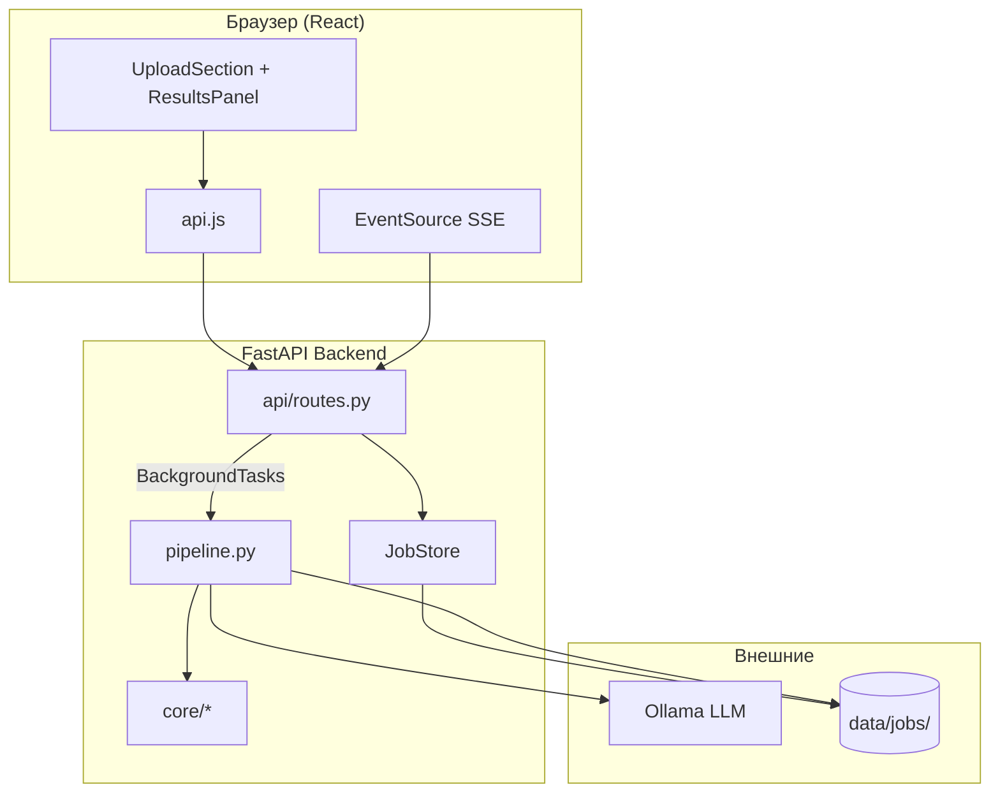
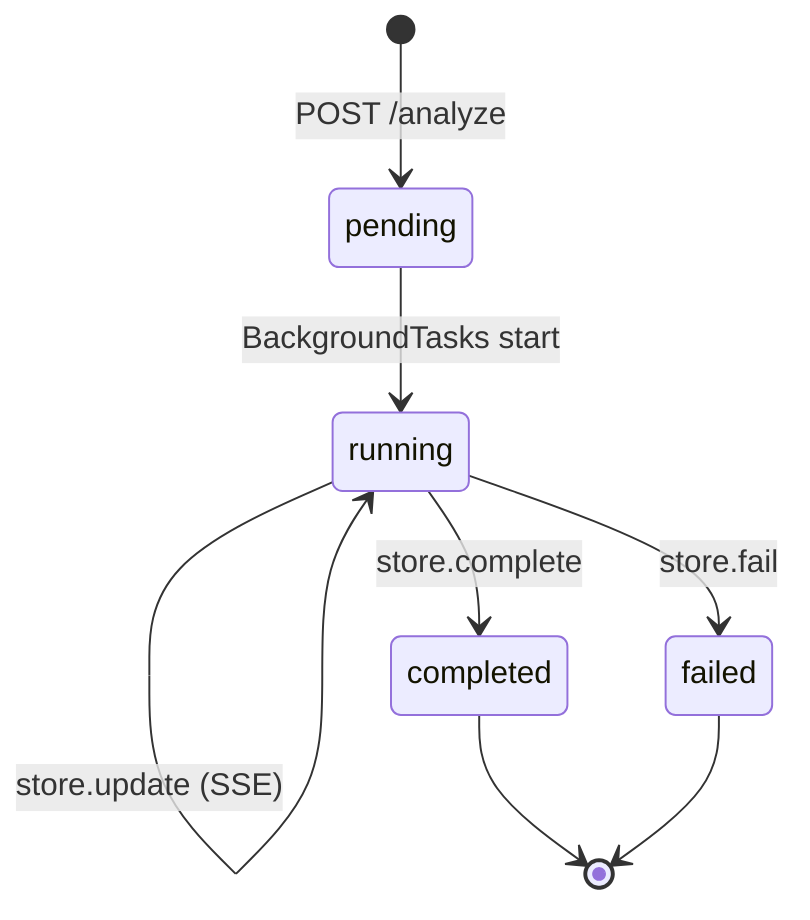

# Архитектура системы

## Общая схема

## Слои backend

| Слой | Ответственность | Файлы |
|------|-----------------|-------|
| HTTP | Маршруты, валидация, файлы | `api/routes.py`, `models.py` |
| Оркестрация | Порядок шагов, параллелизм | `core/pipeline.py` |
| Доменная логика | Анализ, метрики, графики | `core/data_*.py`, `visualization.py`, `reports.py` |
| LLM | Промпты и вызовы Ollama | `core/llm.py`, `core/prompts.py` |
| Экспорт | DOCX, XLSX | `core/*_export.py` |
| Инфраструктура | Задачи, диск, SSE | `jobs.py`, `config.py` |

## Слои frontend

| Слой | Ответственность | Файлы |
|------|-----------------|-------|
| Shell | Состояние приложения, режимы hero/analysis | `App.jsx` |
| Hooks | SSE, настройки | `hooks/useJobStream.js`, `useSettings.js` |
| Features | Загрузка, прогресс, результаты | `components/*`, `components/results/*` |
| API | HTTP + SSE + скачивание | `api.js` |
| Presentation | CSS, темы | `index.css`, `App.css`, `theme-overrides.css` |

## Жизненный цикл задачи (Job)

Каждая задача получает UUID. Состояние хранится:

1. **В памяти** — `JobStore._jobs`
2. **На диске** — `data/jobs/{id}/job_state.json`
3. **Артефакты** — `data/jobs/{id}/output/`

При рестарте сервера задачи восстанавливаются из `job_state.json`.

## SSE (Server-Sent Events)

Клиент открывает `GET /api/jobs/{id}/stream`. Сервер:

1. Сразу отправляет текущее состояние задачи.
2. При каждом `JobStore.update/complete/fail` кладёт JSON в очередь подписчика.
3. Каждые 30 с шлёт keepalive (`: keepalive`).
4. Закрывает поток при `status ∈ {completed, failed}`.

Frontend (`useJobStream`) обновляет `job` на каждое сообщение и снимает `loading` при терминальном статусе.

## Параллелизм в пайплайне

| Операция | Механизм |
|----------|----------|
| Тяжёлый Python (pandas, plots) | `asyncio.to_thread` |
| Сохранение TXT/DOCX | `asyncio.gather` + `to_thread` в `_save_reports_parallel` |
| Графики ∥ сохранение анализа/гипотез | `asyncio.gather` на шаге `viz_generation` |
| Вызовы LLM | Последовательно (анализ → гипотезы) |

Event loop FastAPI не блокируется во время расчётов.

## Границы ответственности

**Backend знает:**
- Как читать файлы, считать метрики, рисовать графики.
- Как формировать промпты и парсить ответы LLM.
- Где и в каком формате сохранять артефакты.

**Frontend знает:**
- Как отобразить `results` и статус задачи.
- Как скачать файлы и показать прогресс.
- Настройки темы и модели (localStorage).

**Frontend не знает** деталей алгоритмов — только ключи в `job.results` (см. [data-model.md](data-model.md)).

## Безопасность (текущее состояние)

| Аспект | Статус |
|--------|--------|
| Аутентификация | Нет (локальный инструмент) |
| Изоляция задач | По UUID, без проверки владельца |
| Sandbox `/run-code` | `exec()` с ограниченным контекстом — **не для публичного деплоя** |
| Загрузка файлов | Только `.csv`/`.xlsx`, размер не лимитирован в коде |

Подробный разбор рисков — в [code-review.md](code-review.md).
