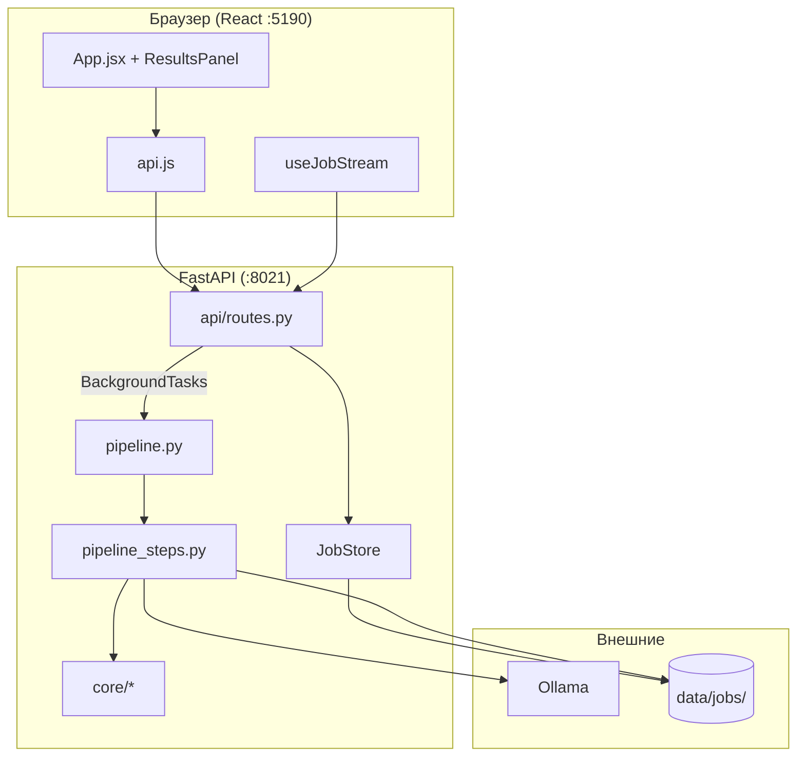
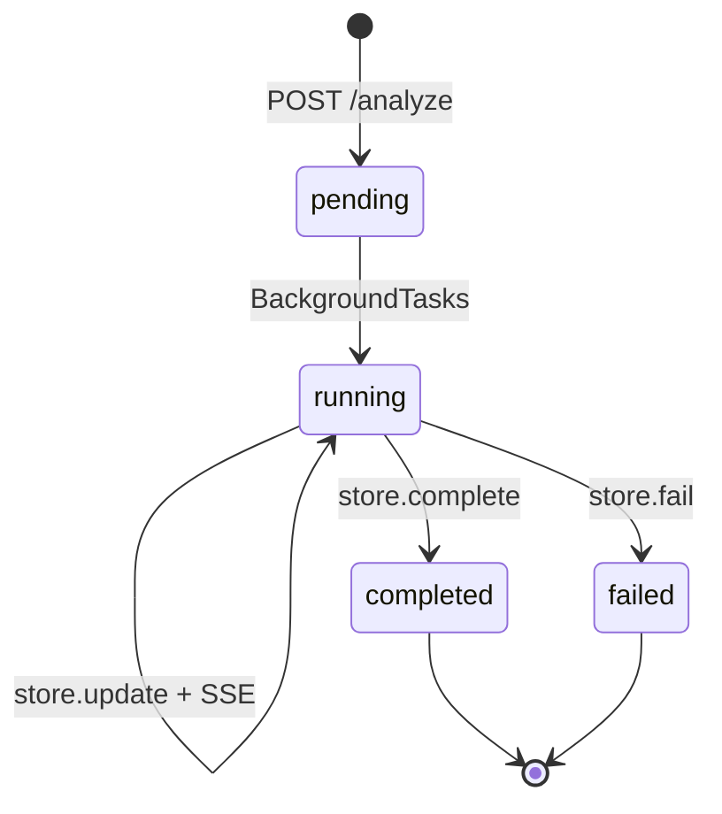

# Архитектура системы

Смысл слоёв и путь клика — в [onboarding.md](onboarding.md). Здесь — схема компонентов.

## Общая схема

## Слои backend

| Слой | Ответственность | Файлы |
|------|-----------------|-------|
| HTTP | Маршруты, загрузка, гипотезы, sandbox | `api/routes.py`, `api/artifacts.py`, `models.py` |
| Оркестрация | Порядок шагов | `core/pipeline.py`, `pipeline_steps.py` |
| Помощники пайплайна | Одна таблица, графики, I/O | `core/pipeline_helpers.py` |
| Домен | Типы, качество, инсайты, графики, отчёт | `data_analysis.py`, `data_insights.py`, `scientific_discovery.py`, `relations.py`, `visualization.py`, `reports.py` |
| LLM | Один промпт интерпретации | `llm.py`, `prompts.py` |
| Экспорт | DOCX, XLSX | `*_export.py` |
| Инфраструктура | Job, диск, SSE | `jobs.py`, `config.py` |

## Слои frontend

| Слой | Ответственность | Файлы |
|------|-----------------|-------|
| Shell | Режимы hero/analysis, история | `App.jsx` |
| Hooks | SSE, настройки, активная таблица | `hooks/` |
| Features | Загрузка, прогресс, вкладки | `components/`, `components/results/` |
| API | HTTP, SSE, blob-скачивание | `api.js` |
| Presentation | Токены и темы | `index.css`, `App.css`, `styles/` |

## Жизненный цикл Job

Состояние:

1. Память — `JobStore._jobs`
2. Диск — `data/jobs/{id}/job_state.json`
3. Артефакты — `data/jobs/{id}/output/`
4. Обработанные фреймы — `analysis_df.pkl` (песочница)

При старте сервера все папки в `JOBS_DIR` поднимаются с диска (`list_all` / `_load_from_disk`). История UI — это этот список.

## SSE

`GET /api/jobs/{id}/stream`:

1. Сразу текущий snapshot.
2. При `update` / `complete` / `fail` / `patch_results` — JSON в очереди подписчиков.
3. Keepalive каждые 30 с (`: keepalive`).
4. Закрытие при `completed` | `failed`.

Клиент дополнительно поллит `GET /api/jobs/{id}` раз в 2 с (`useJobStream`), если SSE отвалился.

## Параллелизм

| Операция | Механизм |
|----------|----------|
| pandas / matplotlib | `asyncio.to_thread` |
| Структура нескольких таблиц | `asyncio.gather` по таблицам |
| Графики ∥ LLM-анализ | `gather` в `step_analysis_and_visualizations` |
| TXT/DOCX | `gather` + `to_thread` |

Event loop FastAPI не должен крутить pandas напрямую.

## Границы

**Backend:** чтение файлов, алгоритмы, промпт, файлы на диске, контракт `results`.

**Frontend:** отображение `results` и статуса, скачивание, тема/модель в localStorage.

Ключи, которые ждёт UI, — [data-model.md](data-model.md). Новая вкладка без нового поля в `state` останется пустой.

## Безопасность (как есть)

| Аспект | Статус |
|--------|--------|
| Auth | Нет |
| Изоляция Job | UUID, без владельца |
| Sandbox | `exec` — только локально |
| Upload | `.csv`/`.xlsx`, до 10 файлов, размер в коде не ограничен |

Разбор — [code-review.md](code-review.md).
