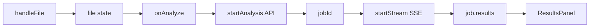

# Frontend — UI и клиентская логика

Путь: `new/frontend/src/`

## Структура исходников

```
src/
├── App.jsx                 # Корневой компонент
├── App.css                 # Стили компонентов (~1900 строк)
├── main.jsx                # Bootstrap React
├── index.css               # Дизайн-токены и 8 тем
├── api.js                  # HTTP + SSE клиент
├── settings.js             # Тема и модель в localStorage
├── constants.js            # Шаги пайплайна и вкладки результатов
├── hooks/
│   ├── useJobStream.js
│   └── useSettings.js
├── components/
│   ├── AppHeader.jsx
│   ├── UploadSection.jsx
│   ├── PipelineStepper.jsx
│   ├── StatsCards.jsx
│   ├── ErrorAlert.jsx
│   ├── SettingsModal.jsx
│   ├── CodeSandbox.jsx
│   └── results/
│       ├── ResultsPanel.jsx      # Оболочка результатов
│       ├── sectionMeta.js        # hasData / textContent
│       ├── PreviewTable.jsx
│       ├── StructureView.jsx
│       ├── InsightsView.jsx
│       ├── MetricsPlanView.jsx
│       ├── AnalysisView.jsx
│       ├── HypothesesView.jsx
│       ├── ReportView.jsx
│       ├── PlotsGallery.jsx
│       ├── CopyButton.jsx
│       └── textFormat.jsx
├── utils/
│   ├── format.js
│   └── icons.js
└── styles/
    └── theme-overrides.css
```

---

## Режимы интерфейса

### Hero-режим (`app--hero`)

Условие: нет активной задачи и не идёт загрузка (`!job && !loading`).

- Полноэкранная зона загрузки по центру.
- Заголовок «Электронный Датасаентист».
- Список возможностей внизу.

### Режим анализа (`app--analysis`)

Условие: `job || loading`.

Двухколоночная сетка:

| Левая колонка | Правая колонка |
|---------------|----------------|
| Компактная загрузка (dock) | `ResultsPanel` |
| Прогресс, степпер, статистика | 11 вкладок результатов |

Переход анимирован через `framer-motion` (`layoutId="upload-shell"`).

---

## Поток данных в `App.jsx`



**Локальное состояние:**
- `file`, `dragOver`, `graphCount`, `jobId`, `activeSection`, `elapsed`
- `analystModels` из `GET /api/config`

**Из хуков:**
- `job`, `loading`, `error` — `useJobStream`
- `settings`, `draft`, modal — `useSettings`

---

## Хуки

### `useJobStream`

| Export | Поведение |
|--------|-----------|
| `startStream(id)` | Открывает SSE, `loading=true` |
| `job` | Последний payload с сервера |
| `loading` | false при completed/failed |
| `setError` | Ошибки валидации файла / сети |

При обрыве SSE — fallback `getJobStatus`.

### `useSettings`

- `settings` — persisted в `localStorage` (`ds-app-settings`).
- `draft` — редактируемая копия в модалке.
- `applyTheme` при смене темы (live preview).

---

## Вкладки результатов

Конфигурация: `constants.js` → `RESULT_SECTIONS` (11 вкладок).

| ID | Компонент | Ключевые поля `results` |
|----|-----------|-------------------------|
| `preview` | `PreviewTable` | `preview`, `shape` |
| `structure` | `StructureView` | `data_structure` |
| `insights` | `InsightsView` | `quality_report`, `correlations` |
| `metrics_plan` | `MetricsPlanView` | `metrics_plan_dict` |
| `calculation_code` | `CodeSandbox` | `calculation_code` |
| `metrics` | `<pre>` | `metrics_results_raw` |
| `analysis` | `AnalysisView` | `analysis_summary` |
| `hypotheses` | `HypothesesView` | `hypotheses` |
| `viz_code` | `<pre>` | `viz_code` |
| `report` | `ReportView` | `final_report` |
| `plots` | `PlotsGallery` | `plot_files` |

### Индикаторы в навигации

`sectionHasData(id, results)` — класс `has-data` и точка `nav-dot`.

### Панель действий (toolbar)

| Вкладка | Действия |
|---------|----------|
| Любая с текстом | Копировать |
| Качество | TXT качество + связи |
| Анализ | DOCX анализа |
| Гипотезы | TXT + DOCX гипотез |
| Структура | XLSX |
| Графики | Скачать все PNG |
| Отчёт | DOCX отчёта |

Скачивание DOCX/XLSX — через `downloadJobFile` (fetch + blob), не прямая ссылка.

---

## Форматирование текста

### `textFormat.jsx`

- `AnalysisInline` — парсинг `**жирный**`.
- `parseReportSections` — разбиение отчёта по `1. Заголовок`.
- `FeatureLine` — шаблон `**Имя** — описание`.

### `AnalysisView` / `ReportView`

Рендерят LLM-текст и итоговый отчёт в читаемые блоки (списки, подзаголовки, KV-пары).

---

## Темы оформления

8 тем в `settings.js`:

| ID | Режим | Описание |
|----|-------|----------|
| `light` | light | Светлая нейтральная |
| `ocean` | light | Голубые оттенки |
| `dark` | dark | Тёмная нейтральная |
| `dracula` | dark | Фиолетово-розовая |
| `nord` | dark | Арктическая |
| `solarized` | dark | Тёплая Solarized |
| `catppuccin` | dark | Пастельная |
| `monokai` | dark | Редакторская |

Механизм:
- `data-theme` — палитра CSS-переменных (`index.css`).
- `data-theme-mode` — `light` / `dark` для оверрайдов (`theme-overrides.css`).

---

## API-клиент (`api.js`)

База: `/api` (прокси Vite в dev).

Ключевые функции — см. [api-reference.md](api-reference.md).

Вспомогательные:
- `parseApiDetail` — единый разбор ошибок FastAPI.
- `triggerBlobDownload` — программное скачивание blob.

---

## Сборка и dev

| Команда | Действие |
|---------|----------|
| `npm run dev` | Vite :5173, proxy `/api` → :8000 |
| `npm run build` | Production в `dist/` |
| `npm run preview` | Просмотр `dist/` |

Конфиг: `vite.config.js` — только proxy и порт, без алиасов.

---

## Степпер прогресса

`PipelineStepper` синхронизирован с `PIPELINE_STEPS` (11 шагов, включая `hypotheses_generation`).

Логика подсветки:
- **done** — индекс < текущего или `step === 'completed'`
- **active** — текущий индекс и `status === 'running'` (спиннер)
- **error** — `status === 'failed'` на текущем шаге
