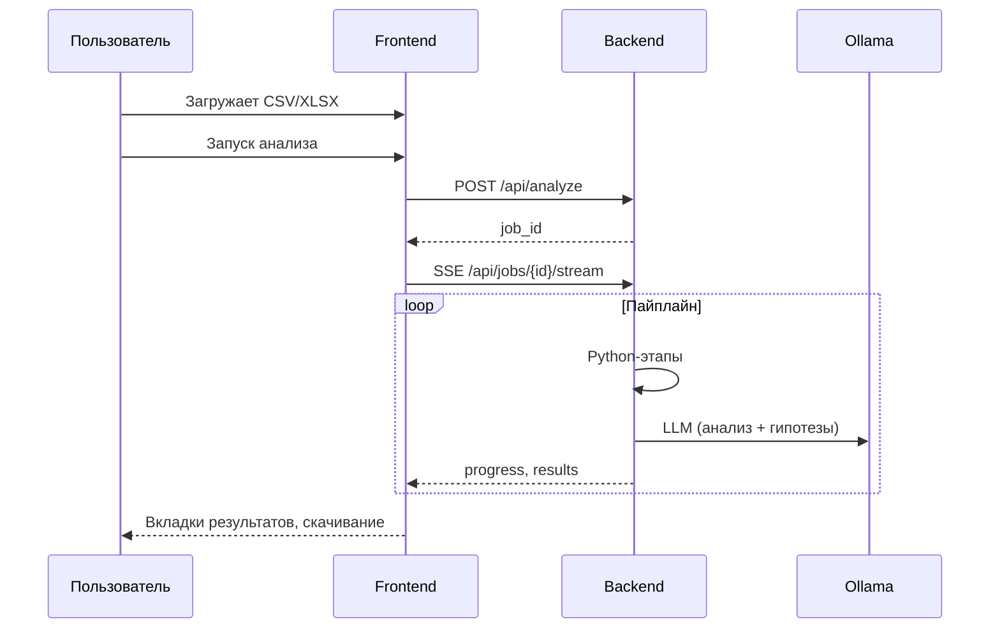

# Обзор проекта

## Назначение

**Электронный Data Scientist** — веб-приложение для автоматического анализа табличных данных (CSV, Excel). Пользователь загружает файл, система последовательно:

1. Определяет структуру столбцов и их семантические типы.
2. Оценивает качество данных и находит связи между столбцами.
3. Строит план метрик и рассчитывает статистики на Python.
4. Интерпретирует результаты и формулирует проверяемые гипотезы с помощью LLM.
5. Строит графики и формирует итоговый отчёт на русском языке.

Результаты доступны в браузере в реальном времени и скачиваются как TXT, DOCX, XLSX, PNG.

## Ключевые возможности

| Область | Что делает система |
|---------|-------------------|
| Загрузка | Drag-and-drop или выбор файла `.csv` / `.xlsx` |
| Прогресс | SSE-стриминг статуса задачи, степпер этапов |
| Данные | Превью первых 20 строк |
| Структура | Таблица типов столбцов, экспорт в XLSX |
| Качество | Оценка 0–100, замечания по столбцам, корреляции |
| Метрики | Детерминированный план и расчёт без LLM |
| Анализ | Текстовая интерпретация метрик (Ollama) |
| Гипотезы | 5–8 проверяемых гипотез в структурированном виде |
| Графики | До 30 PNG (matplotlib/seaborn), скачивание по одному или все |
| Отчёт | Многосекционный итоговый документ |
| Песочница | Выполнение пользовательского Python-кода на датасете |
| Настройки | 8 тем оформления, выбор LLM-модели |

## Технологический стек

### Backend (`new/backend/`)

| Компонент | Технология |
|-----------|------------|
| HTTP API | FastAPI, Uvicorn |
| Данные | pandas, numpy, openpyxl |
| Визуализация | matplotlib, seaborn |
| LLM | Ollama + LangChain (`langchain-community`) |
| Документы | python-docx |
| Асинхронность | asyncio, BackgroundTasks, SSE |

### Frontend (`new/frontend/`)

| Компонент | Технология |
|-----------|------------|
| UI | React 18 |
| Сборка | Vite 5 |
| Анимации | framer-motion |
| Иконки | lucide-react |
| Стили | CSS-переменные, 8 тем |

### Внешние сервисы

- **Ollama** — локальный сервер LLM (по умолчанию `http://localhost:11434`)
- Рекомендуемая модель: `qwen3:8b` (настраивается в UI)

## Философия пайплайна: Python-first

Актуальная версия **не повторяет** legacy-подход из `ins_temp3.py`, где LLM генерировала и выполняла Python-код.

| Этап | Legacy (`ins_temp3.py`) | Актуальная (`new/`) |
|------|-------------------------|---------------------|
| Структура данных | LLM | Python (`data_analysis.py`) |
| План метрик | LLM | Python (правила по типу столбца) |
| Расчёт метрик | LLM-код + REPL | Python (`compute_metrics`) |
| Визуализация | LLM-код + REPL | Python (`visualization.py`) |
| Итоговый отчёт | LLM | Python (`reports.py`) |
| Интерпретация | LLM | LLM (`DATA_ANALYZE`) |
| Гипотезы | — | LLM (`DATA_HYPOTHESES`) |

Преимущества: предсказуемость, скорость, отсутствие риска выполнения произвольного LLM-кода в основном пайплайне.

## Структура репозитория

```
электронный DS/
├── docs/                    # Эта документация
├── DOCUMENTATION.md         # Legacy: Streamlit / ins_temp3.py
├── ins_temp3.py             # Legacy-приложение (Streamlit)
├── new/
│   ├── backend/
│   │   ├── app/
│   │   │   ├── main.py          # Точка входа FastAPI
│   │   │   ├── config.py        # Настройки и пути
│   │   │   ├── jobs.py          # Хранение задач + SSE
│   │   │   ├── models.py        # Pydantic-схемы
│   │   │   ├── api/routes.py    # HTTP-маршруты
│   │   │   └── core/            # Бизнес-логика
│   │   ├── data/jobs/           # Файлы задач (runtime)
│   │   └── requirements.txt
│   └── frontend/
│       ├── src/
│       └── package.json
└── venv/                    # Общее виртуальное окружение (опционально)
```

## Пользовательский сценарий (кратко)



Подробности — в [architecture.md](architecture.md) и [pipeline.md](pipeline.md).
