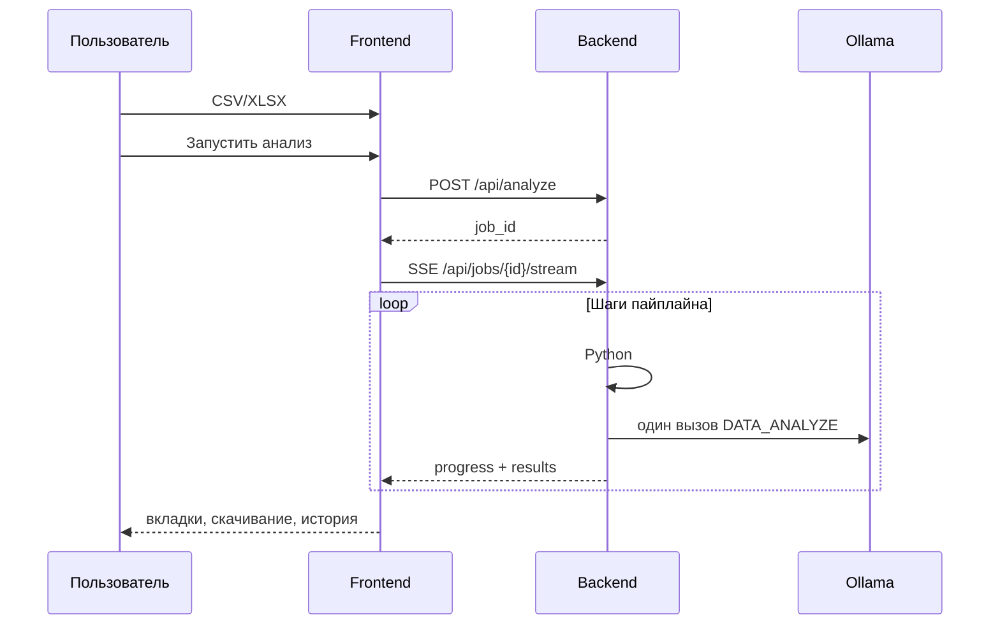

# Обзор проекта

## Назначение

**Электронный Data Scientist** — локальное веб-приложение для автоматического анализа табличных данных (CSV, Excel). Пользователь загружает один или несколько файлов; система по фиксированному конвейеру:

1. Читает таблицы **по отдельности** (лист Excel = таблица) и ищет возможные ключи связи, **не джойня** их.
2. Определяет семантические типы столбцов.
3. Оценивает качество, корреляции, аномалии и формулирует гипотезы **расчётами Python**.
4. Считает статистики и строит графики на Python.
5. Просит LLM только коротко прокомментировать уже посчитанные факты.
6. Собирает итоговый отчёт на русском.

Результаты приходят в браузер по SSE по мере готовности шагов и скачиваются как TXT, DOCX, XLSX, PNG.

Подробный вход в код — [onboarding.md](onboarding.md). Алгоритм шагов — [pipeline.md](pipeline.md).

## Ключевые возможности

| Область | Что делает система |
|---------|-------------------|
| Загрузка | Drag-and-drop, до 10 файлов `.csv` / `.xlsx` |
| Несколько таблиц | Связи join/union как отчёт, анализ каждой таблицы отдельно |
| Прогресс | SSE + степпер этапов |
| Данные | Превью 20 строк, переключатель таблиц |
| Структура | Типы столбцов, XLSX |
| Качество | Балл 0–100, замечания, корреляции |
| Инсайты | Выбросы, ядро/хвост категорий, подозрительные значения |
| Метрики | Детерминированный план и расчёт |
| Анализ | 6–8 предложений от LLM (или Python-бриф, если Ollama недоступна) |
| Гипотезы | Из Python; аудитор может добавить свои после завершения |
| Графики | До 30 PNG, DOCX с пояснениями |
| Отчёт | Многосекционный TXT/DOCX |
| Песочница | Пользовательский Python на датасете задачи |
| История | Список прошлых Job, повторный просмотр |
| Настройки | Темы оформления, выбор модели Ollama |

## Технологический стек

### Backend (`backend/`)

| Компонент | Технология |
|-----------|------------|
| HTTP API | FastAPI, Uvicorn |
| Данные | pandas, numpy, openpyxl |
| Визуализация | matplotlib (Agg), seaborn |
| LLM | Ollama + LangChain (`langchain-community`, `langchain-classic`) |
| Документы | python-docx |
| Асинхронность | asyncio, BackgroundTasks, SSE |

Dev-порт API: **8021** (`API_PORT`).

### Frontend (`frontend/`)

| Компонент | Технология |
|-----------|------------|
| UI | React 18 |
| Сборка | Vite 5 |
| Анимации | framer-motion |
| Иконки | lucide-react |
| Стили | CSS-переменные, темы |

Dev-порт UI: **5190** (`VITE_DEV_PORT`), прокси `/api` → `127.0.0.1:8021`.

### Внешние сервисы

- **Ollama** — `http://127.0.0.1:11434`
- Модель по умолчанию: `qwen3.8:27b` (whitelist в `config.py`, выбор в UI)
- **Docker** (опционально) — [docker.md](docker.md)

## Философия: Python-first

Актуальная версия **не** генерирует и не исполняет Python от LLM (так было в `ins_temp3.py`).

| Этап | Legacy Streamlit | Сейчас |
|------|------------------|-----------------|
| Структура | LLM | Python `data_analysis.py` |
| Качество / корреляции | — | Python `data_insights.py` |
| Инсайты / гипотезы | — / LLM | Python `scientific_discovery.py` |
| План и расчёт метрик | LLM-код + REPL | Python |
| Визуализация | LLM-код + REPL | Python `visualization.py` |
| Итоговый отчёт | LLM | Python `reports.py` |
| Интерпретация | LLM | LLM `DATA_ANALYZE` (с fallback) |

Плюсы: предсказуемые цифры, скорость, нет произвольного кода модели в основном потоке.

## Структура репозитория

```
ai-ds/
├── datasets/                 тестовые файлы
├── docs/                     эта документация
├── DOCUMENTATION.md          legacy Streamlit
├── backend/app/              FastAPI + core
├── frontend/src/             React
├── docker/                   полный стек
└── old/                      Streamlit
```

## Пользовательский сценарий


