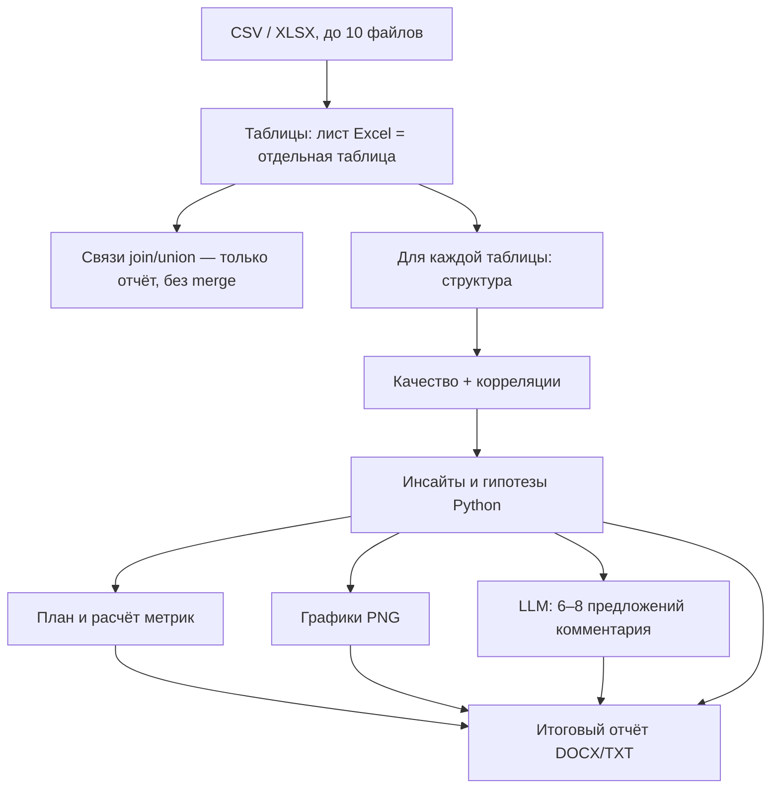

# Пайплайн анализа данных

Точка входа: `run_analysis_pipeline(job_id, store)` в `backend/app/core/pipeline.py`.

Запускается как фоновая задача после `POST /api/analyze`. Оркестратор только вызывает шаги из `pipeline_steps.py` и в конце `store.complete` / `store.fail`. Общий объект шагов — `PipelineContext` (job, store, таблицы, накопленный `state`).

Тяжёлый pandas/matplotlib выполняется в `asyncio.to_thread`. Расчёт по одной таблице — `structure_and_analyze` → `analyze_one_table` в `pipeline_helpers.py` (структура, качество, инсайты и метрики считаются **сразу**, UI узнаёт о них поэтапно).

## Сводная таблица этапов

| # | `step` (ID для UI) | Прогресс | Движок | Функция |
|---|--------------------|----------|--------|---------|
| 1 | `preparing` | 5→10 | Python | `step_prepare` |
| 2 | `structure_analysis` | 18→25 | Python | `step_structure` |
| 3 | `data_insights` | 28→30 | Python | `step_insights` |
| 4 | `scientific_discovery` | 31→34 | Python | `step_discovery` |
| 5 | `metrics_plan` / `metrics_calculation` | 36→55 | Python | `step_metrics` |
| 6 | `metrics_analysis` | 60→65 | **LLM** ∥ Python-графики | `step_analysis_and_visualizations` |
| 7 | `hypotheses_generation` | 72 | Python (уже готово) | те же гипотезы, что на шаге 4 |
| 8 | `viz_generation` | 74→82 | Python | сохранение PNG/DOCX графиков |
| 9 | `final_report` | 86→92 | Python | `step_final_report` |
| 10 | `completed` | 100 | — | `store.complete` |

Степпер UI (`PIPELINE_STEPS` в `constants.js`) должен совпадать с этими `step`. Есть также id `visualization` в степпере — исторический ярлык «Отчёт»; бэкенд пишет `final_report`.

## Диаграмма потока



---

## Этап 1. Подготовка (`preparing`)

**Цель:** загрузить таблицы и отдать превью в UI.

1. `job_file_entries` — список `(path, original_name)` из `job.file_paths`.
2. `load_tables` — CSV (utf-8 → latin1 → cp1251) и XLSX (каждый непустой лист — таблица). Лимит таблиц: `MAX_TABLES = 20`.
3. `tables_meta` — превью 20 строк на таблицу без самого DataFrame в JSON.
4. `detect_relations` — кандидаты join (имена столбцов + пересечение значений) и union (похожие схемы). **Таблицы не объединяются.**
5. Если все таблицы пустые — `ValueError`, задача падает.

В `state`:

- `preview` / `columns` / `shape` — **первая** таблица (для совместимости старого UI);
- `tables`, `table_count`;
- `relations`, `relations_raw`.

Файл: `output/relations.txt`.

---

## Этап 2. Структура (`structure_analysis`)

Для каждой таблицы параллельно: `structure_and_analyze`.

`analyze_data_structure(df)` в `data_analysis.py` ставит `kind`:

| `kind` | Критерии (упрощённо) |
|--------|----------------------|
| `numeric` | Числовой dtype, не похож на ID |
| `categorical` | Низкая кардинальность / object |
| `datetime` | dtype datetime или успешный parse + подсказка в имени |
| `boolean` | True/False, 0/1 |
| `identifier` | Имя вроде id/key и почти все значения уникальны |
| `textual` | Длинные строки, высокая кардинальность |

В том же вызове уже считаются качество, discovery и метрики (`analyze_one_table`), но в UI на этом шаге отдаётся структура.

Обработанные DataFrame пишутся в `analysis_df.pkl` рядом с `output/` — песочница кода читает их позже.

Файл: `output/data_structure.xlsx` (по первой таблице).

При одной таблице в `state`: `data_structure`, `data_structure_raw`. При нескольких — смотреть `tables[i].structure`.

---

## Этап 3. Качество и связи столбцов (`data_insights`)

Тексты качества и корреляций уже посчитаны. Шаг склеивает блоки `=== имя таблицы ===`.

### Отчёт качества (`build_quality_report`)

- Общий балл 0–100 и грейд (`good` / `fair` / `poor`).
- По столбцам: пропуски %, уникальность, флаги (`high_missing`, `constant`, `likely_identifier`, …).

### Корреляции (`compute_correlations`)

| Пара | Метрика |
|------|---------|
| Число ↔ число | Pearson *r* |
| Категория ↔ категория | Cramér's *V* |
| Категория → число | η (eta) |

Файлы: `quality_report.txt`, `correlations.txt`, `quality_insights.xlsx`.

В `state`: `quality_report` / `correlations` (если таблица одна), плюс `*_raw` и `insights_report_raw`.

---

## Этап 4. Инсайты и гипотезы (`scientific_discovery`)

**Модуль:** `core/scientific_discovery.py` → `discover_insights`.

По именам столбцов назначаются роли: geo, money, currency, area, numeric, categorical, datetime, identifier.

Дальше детерминированные проверки, например:

- **concentration** — ядро категорий, покрывающее ~80% строк, и периферия (редкие значения, в т.ч. «города вне основной области»);
- **numeric_outlier** — IQR и modified z-score;
- **implausible** — подозрительные деньги/площади (нули, отрицательные);
- **label_duplicates** — почти одинаковые подписи;
- **group_profiles** — медианы чисел по группам;
- **tests** — Spearman / Kruskal по сильным связям.

`hypotheses_from_discovery` превращает находки в список объектов (до 14 на таблицу). Если таблиц несколько, добавляются гипотезы из `relations_hypotheses` (найденный ключ join и т.п.).

Поля гипотезы: `id`, `kind`, `kind_label`, `title`, `statement`, `rationale`, `columns`, `verification`, `priority`, `source: "python"`.

Файл: `discovery_insights.txt`. В `state`: `discovery`, `discovery_brief`, `discovery_raw`, `hypotheses`. Вкладка «Инсайты» дописывает discovery к отчёту качества.

---

## Этап 5. Метрики (`metrics_plan`, `metrics_calculation`)

План уже построен в `analyze_one_table`. Шаг только публикует его в `state`.

Примеры набора метрик по `kind`:

- **numeric:** count, mean, median, std, min, max, квантили, skew, …
- **categorical:** count, nunique, mode, …
- **datetime:** min_date, max_date, date_range_days, …
- **identifier:** count, nunique

`format_calculation_code_reference` — **псевдокод** для вкладки «Код», не исполняемый LLM-скрипт.

`compute_metrics` — реальный расчёт pandas.

Файл: `generated_calculation_code.py`.

Если ни у одной таблицы нет плана — ошибка, пайплайн падает.

---

## Этап 6–8. Анализ LLM + графики (`metrics_analysis` → `viz_generation`)

В `step_analysis_and_visualizations` **параллельно**:

1. `run_all_visualizations` — для каждой таблицы свой лимит графиков (`split_graph_count`). PNG сначала во временной папке, потом копируются как `{table_id}__plot_001.png` при нескольких таблицах.
2. `run_llm_analysis` — промпт `DATA_ANALYZE`: на вход усечённый `discovery_brief` и краткие связи таблиц. Ответ: 6–8 предложений на русском. Если Ollama падает — в UI идёт Python-бриф, задача **не** fail.

Гипотезы на этом шаге **не пересчитываются LLM**. `hypotheses` = python-список с этапа 4. Промпт `DATA_HYPOTHESES` в коде есть, но пайплайн его не вызывает.

Затем:

- DOCX/TXT анализа и гипотез (`save_analysis_reports`);
- `generated_visualization_code.py`;
- `plots_report.docx` (`ensure_plots_report_docx`).

Графики (`visualization.py`): кандидаты ранжируются по важности столбца и по discovery (выбросы, ядро рынка). Типы: пропуски, heatmap, гистограмма, box, bar, scatter, time series, violin — что позволяет состав данных, до `graph_count`.

---

## Этап 9. Итоговый отчёт (`final_report`)

`build_final_report` в `reports.py` — **без LLM**. Секции на русском: характеристика, качество, инсайты, метрики, интерпретация, гипотезы, графики, рекомендации, ограничения. Если таблиц > 1, явно сказано, что join не делался.

Файлы: `final_report.txt`, `final_report.docx`.

---

## Обработка ошибок

Любое исключение в `try/except` оркестратора:

```python
await store.fail(job_id, str(e), ctx.state)
```

- `status` → `failed`
- `error` → текст
- `results` → то, что успели положить в `ctx.state`

UI показывает ошибку слева и на текущем шаге степпера.

---

## Модули, которые пайплайн не вызывает

| Модуль / промпт | Зачем оставлен |
|-----------------|----------------|
| `DATA_HYPOTHESES` | Черновик «перефразировать python-гипотезы»; не подключён |
| `STRUCT_ANALYZE`, `M_PLAN`, `CODE_GEN`, `VIZ_GEN`, `FINAL_REP` | Legacy LLM-heavy пайплайн |
| `parsers.py`, `code_runner.py` | Если ещё лежат в `core/` — не часть текущего потока |

Не путать с песочницей: `sandbox.py` вызывается только из `POST /api/jobs/{id}/run-code` по кнопке пользователя.
