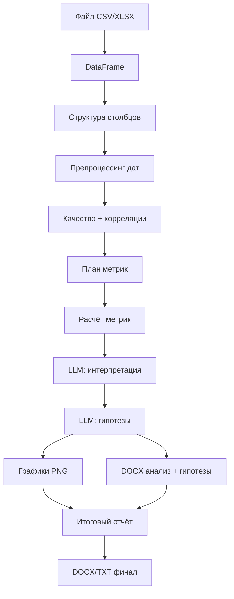

# Пайплайн анализа данных

Точка входа: `run_analysis_pipeline(job_id, store)` в `new/backend/app/core/pipeline.py`.

Запускается как фоновая задача после `POST /api/analyze`.

## Сводная таблица этапов

| # | `step` (ID) | Прогресс | Движок | Основные функции |
|---|-------------|----------|--------|------------------|
| 1 | `preparing` | 5→10 | Python | `load_dataframe` |
| 2 | `structure_analysis` | 18→25 | Python | `analyze_data_structure`, `build_structure_xlsx` |
| 3 | `data_insights` | 28→30 | Python | `preprocess_dates_based_on_llm`, `build_quality_report`, `compute_correlations` |
| 4 | `metrics_plan` | 32→38 | Python | `build_metrics_plan` |
| 5 | `metrics_calculation` | 45→55 | Python | `compute_metrics` |
| 6 | `metrics_analysis` | 60→65 | **LLM** | `chain_invoke(DATA_ANALYZE)` |
| 7 | `hypotheses_generation` | 68→72 | **LLM** | `chain_invoke(DATA_HYPOTHESES)`, `parse_hypotheses` |
| 8 | `viz_generation` | 74→82 | Python + I/O | `generate_visualizations` ∥ сохранение отчётов |
| 9 | `visualization` / `final_report` | 86→92 | Python | `build_final_report` |
| 10 | `completed` | 100 | — | `store.complete` |

## Диаграмма потока данных



---

## Этап 1. Подготовка (`preparing`)

**Цель:** загрузить таблицу и отдать превью в UI.

1. `load_tables(file_entries)` — CSV и XLSX (каждый лист Excel — отдельная таблица).
2. `detect_relations` — поиск ключей join (имена + пересечение значений) и одинаковых схем (union).
3. `build_analysis_frame` — left join по найденным ключам или concat при одинаковой схеме; иначе самая большая таблица.
4. Проверка: итоговый DataFrame не пустой.
5. В `state`:
   - `preview` / `columns` / `shape` — объединённая таблица для анализа;
   - `tables` — превью и метаданные каждой исходной таблицы;
   - `relations` / `join_plan` / `relations_raw` — найденные связи.

---

## Этап 2. Структура (`structure_analysis`)

**Модуль:** `core/data_analysis.py` → `analyze_data_structure(df)`

Для каждого столбца определяется:

| `kind` | Критерии (упрощённо) |
|--------|----------------------|
| `numeric` | Числовой dtype |
| `categorical` | Низкая кардинальность / object |
| `datetime` | Успешный parse даты |
| `boolean` | True/False, 0/1 |
| `identifier` | Почти все значения уникальны |
| `textual` | Длинные строки, высокая кардинальность |

**Выход:**
- `data_structure` — JSON `{columns: [...], datetime_candidates: [...]}`;
- `data_structure_raw` — человекочитаемый текст;
- файл `output/data_structure.xlsx` (цветные бейджи типов).

---

## Этап 3. Качество и связи (`data_insights`)

**Препроцессинг:** `preprocess_dates_based_on_llm` — приводит кандидатов в datetime.

### Отчёт качества (`build_quality_report`)

- Общий балл 0–100 и грейд (`good` / `fair` / `poor`).
- По столбцам: пропуски %, уникальность, флаги проблем (`high_missing`, `constant`, `likely_identifier`, …).

### Корреляции (`compute_correlations`)

| Тип связи | Метрика |
|-----------|---------|
| Число ↔ число | Pearson *r* |
| Категория ↔ категория | Cramér's *V* |
| Категория → число | η (eta) |

Сохраняются `quality_report.txt`, `correlations.txt`, `quality_insights.xlsx` (текст + JSON-блок после `---JSON---`).

В `state` также появляется `insights_report_raw` — объединённый текст для вкладки «Качество».

---

## Этап 4. План метрик (`metrics_plan`)

**Функция:** `build_metrics_plan(df, parsed_structure)`

По типу столбца назначается фиксированный набор метрик, например:

- **numeric:** mean, median, std, min, max, skew, …
- **categorical:** unique, top, freq, …
- **datetime:** min, max, range_days, …

**Выход:** `metrics_plan_dict` — `{column_name: [metric, ...]}`.

---

## Этап 5. Расчёт метрик (`metrics_calculation`)

1. `format_calculation_code_reference` — псевдокод для вкладки «Код» (не исполняемый LLM-код).
2. `compute_metrics(df, plan)` — реальный расчёт в Python.
3. `format_metrics_results` — текст для UI и LLM.
4. Файл `generated_calculation_code.py` — справочная запись.

---

## Этап 6. Анализ метрик (`metrics_analysis`) — LLM

**Промпт:** `DATA_ANALYZE` (`core/prompts.py`)

**Вход (с усечением):**
- `metrics_results_raw` — до 8000 символов;
- `quality_report_raw` — до 4000;
- `correlations_raw` — до 4000.

**Ожидаемый формат ответа:** блоки вида `**Столбец** — интерпретация` на русском.

**Выход:** `analysis_summary` → UI вкладка «Анализ», DOCX.

---

## Этап 7. Гипотезы (`hypotheses_generation`) — LLM

**Промпт:** `DATA_HYPOTHESES`

**Вход:** структура, метрики, качество, корреляции, краткий анализ.

**Формат ответа:** JSON-массив между маркерами `---HYPOTHESES_START---` / `---JSON---` / `---HYPOTHESES_END---`.

**Парсинг:** `parse_hypotheses` → список объектов:

```json
{
  "id": "H1",
  "title": "...",
  "statement": "...",
  "rationale": "...",
  "columns": ["col_a", "col_b"],
  "verification": "...",
  "priority": "high|medium|low"
}
```

---

## Этап 8. Визуализация (`viz_generation`)

**Параллельно выполняются:**

1. `generate_visualizations(df, output_dir, graph_count, correlations=..., parsed_structure=...)` — до N PNG:
   - пропуски, heatmap корреляций, гистограммы, boxplot, bar, scatter, time series, violin (по наличию подходящих столбцов).
2. `_save_reports_parallel` — TXT/DOCX анализа и гипотез.

**Выход:**
- `plot_files[]`, `plot_details[]` (метаданные каждого графика: тип, столбцы, описание)
- `viz_code` (описание логики), `generated_visualization_code.py`
- `plots_report.docx` — DOCX-отчёт с встроенными PNG и пояснениями (`ensure_plots_report_docx`)

---

## Этап 9. Итоговый отчёт (`visualization` / `final_report`)

**Функция:** `build_final_report(...)` — **без LLM**.

Секции (8 блоков на русском):

1. Общая характеристика датасета
2. Качество данных
3. Ключевые метрики
4. Интерпретация (из `analysis_summary`)
5. Гипотезы
6. Визуализации (список графиков)
7. Рекомендации (правила из quality report)
8. Ограничения анализа

Сохранение: `final_report.txt`, `final_report.docx`.

---

## Обработка ошибок

Любое необработанное исключение в `try/except` пайплайна:

```python
await store.fail(job_id, str(e), state)
```

- `status` → `failed`
- `error` → текст ошибки
- `results` → частично накопленный `state` (если был)

UI показывает ошибку в левой колонке и на шаге степпера.

---

## Неиспользуемый legacy-код

В `core/` остались модули из `ins_temp3.py`, **не вызываемые** текущим пайплайном:

| Модуль | Назначение (legacy) |
|--------|---------------------|
| `parsers.py` | Парсинг LLM-ответов структуры/метрик |
| `code_runner.py` | Выполнение LLM-кода метрик |
| `prompts.py` | `STRUCT_ANALYZE`, `M_PLAN`, `CODE_GEN`, `VIZ_GEN`, `FINAL_REP` |

Их можно удалить или оставить для экспериментов.
